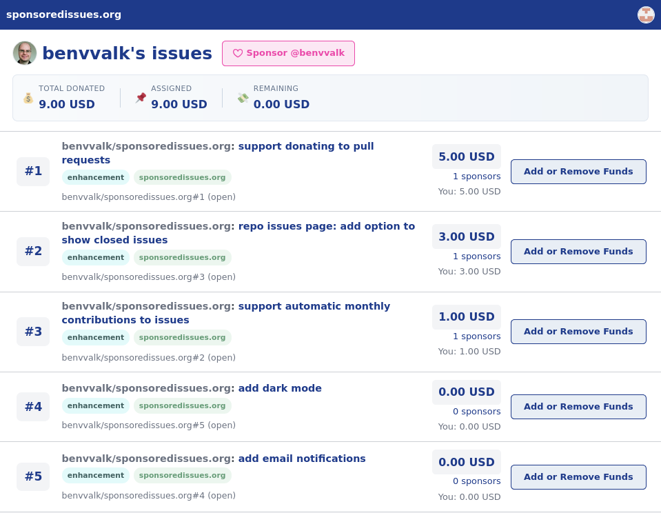

This repo contains the source code for <https://sponsoredissues.org>.

## What is sponsoredissues.org?

`sponsoredissues.org` lets users assign their [Github Sponsors](https://github.com/sponsors) donations to specific GitHub issues, in order to vote for which features and fixes get prioritized. I made it to help chronically underpaid FOSS developers earn more money from their work.

The example screenshot below should give you a rough idea about how the site works. If you would like to know more, please read the [introduction on the homepage](https://sponsoredissues.org) and have a look at the [FAQ](https://sponsoredissues.org/site/faq).

*A screenshot of [my issues list](https://sponsoredissues.org/benvvalk) on sponsoredissues.org. Issues are ranked in descending order of donation total, to let the maintainer know which issues are most important to users.*

## Support sponsoredissues.org and vote for improvements

I use [sponsoredissues.org](https://sponsoredissues.org) to fund its own development ("dogfooding").

If you want to support the project, or if you want to [vote for specific features/fixes](https://sponsoredissues.org/benvvalk), please [send me a donation on GitHub Sponsors](https://github.com/sponsors/benvvalk).